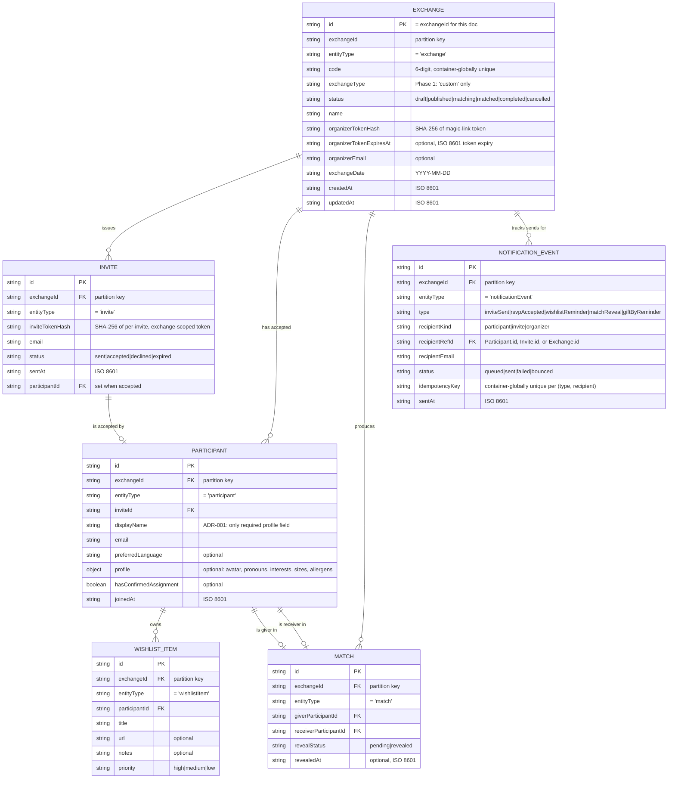

# GiftEx v2 Entity-Relationship Diagram

> See [`data-model-v2.md`](./data-model-v2.md) for field-level detail, Cosmos partitioning strategy, status state machines, and ADR-001 compliance map.

All six v2 entities live in a single Cosmos DB container named `exchanges`, partitioned by `/exchangeId`. The partition key value for every document is annotated on each entity below.

## Relationship summary

| From | Cardinality | To | Notes |
| --- | --- | --- | --- |
| Exchange | 1 — 0..N | Invite | One Invite per recipient email per Exchange |
| Exchange | 1 — 0..N | Participant | Only created when an Invite is accepted |
| Exchange | 1 — 0..N | Match | N = participant count after matching |
| Exchange | 1 — 0..N | NotificationEvent | Audit + dedupe record per send |
| Invite | 1 — 0..1 | Participant | An Invite has at most one Participant (set on accept) |
| Participant | 1 — 0..N | WishlistItem | Multi-item wishlist; frozen after `Exchange.status === 'matched'` |
| Participant | 1 — 0..1 | Match (as giver) | Each Participant gives exactly once after matching; 0 before |
| Participant | 1 — 0..1 | Match (as receiver) | Each Participant receives exactly once after matching; 0 before |

## NotificationEvent recipient resolution

`NotificationEvent.recipientRefId` is polymorphic — its referent depends on `recipientKind`:

| `recipientKind` | `recipientRefId` references | When used |
| --- | --- | --- |
| `participant` | `Participant.id` | After RSVP accept (RSVPAccepted, WishlistReminder, MatchReveal, GiftByReminder) |
| `invite` | `Invite.id` | InviteSent — before a Participant exists |
| `organizer` | `Exchange.id` | Organizer-targeted notifications (organizer is identified by `Exchange.organizerTokenHash`, not a separate user record) |

This is enforced at the application layer, not by foreign-key constraints (Cosmos has none).

## Partition-key implication

Because every entity carries `exchangeId` and uses it as the partition key, loading the full state for a single exchange — Exchange + all Invites + all Participants + all Wishlists + all Matches + recent NotificationEvents — is a single-partition query. This is the hot path for the organizer panel and the RSVP / wishlist / match-reveal views.
